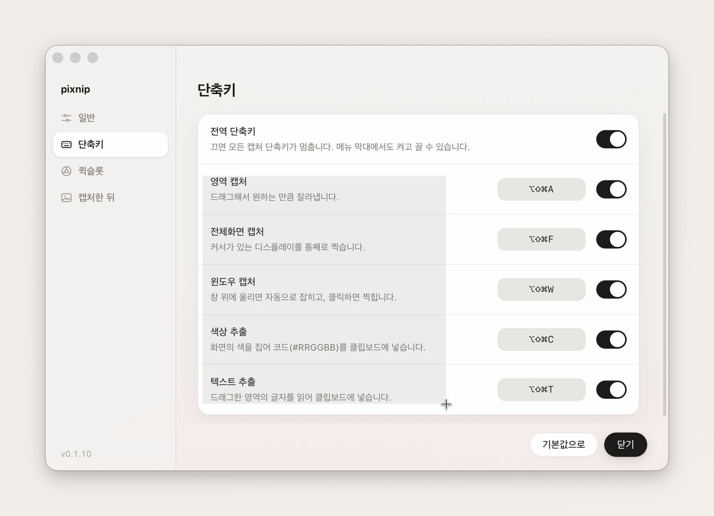
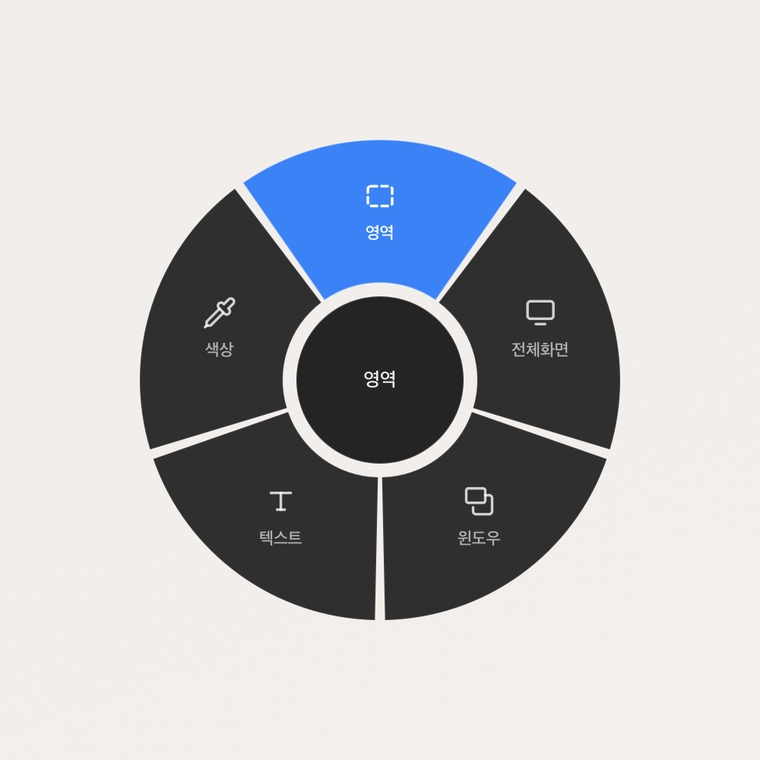
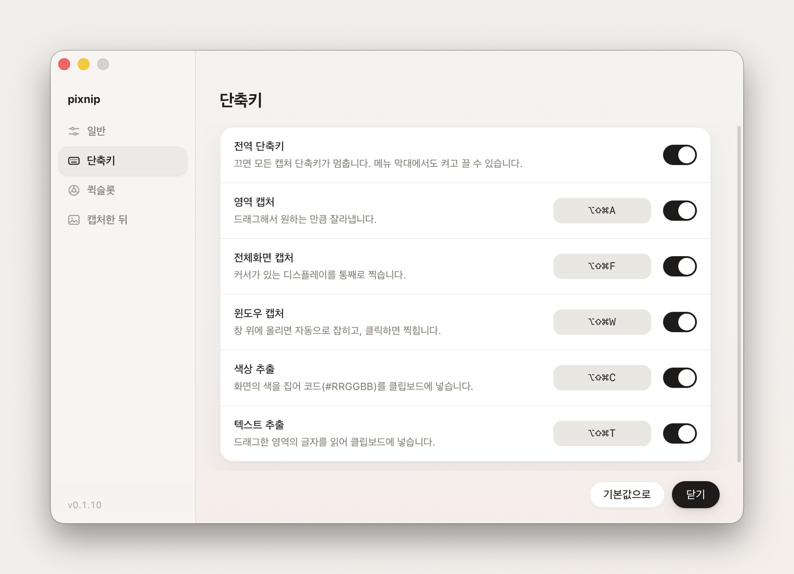
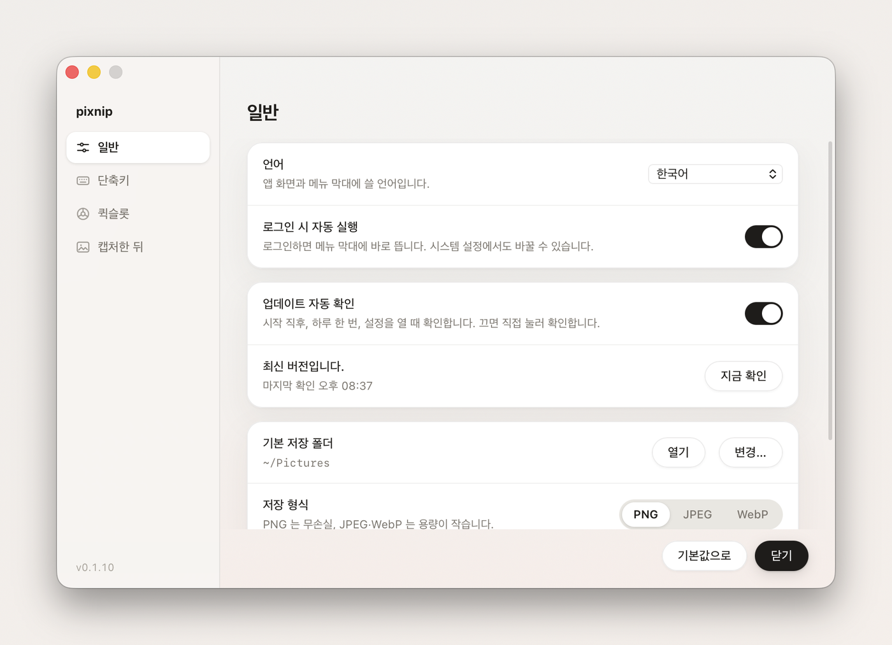

<div align="center">

# pixnip

**맥용 화면 캡처 도구.**

단축키를 누르면 화면이 그 순간에 멈추고, 드래그한 영역이 곧바로 클립보드에 들어갑니다.
이미지로도, 그 안의 글자로도.

macOS 14 이상 · Apple Silicon / Intel · 라이트·다크 · 10개 언어

[English](README.md) · **한국어**

</div>

## 설치

```bash
brew tap 132262b/pixnip && brew trust --cask 132262b/pixnip/pixnip && brew install --cask pixnip
```

한 줄이라 그대로 붙여넣으면 끝납니다. 가운데 `brew trust` 는 Homebrew 가 서드파티
탭에 요구하는 확인 단계입니다.


## 순간을 그대로 잡습니다

단축키를 누르면 살아 있는 화면 위에서 바로 영역을 잡습니다. 설정 → 캡처에서 **화면
고정**을 켜면 누른 그 순간의 화면이 멈춰 있어서, 흘러가는 영상도 열어 둔 메뉴도 눈을
떼면 사라지는 툴팁도 눈으로 본 그대로 잘립니다.

|                 |                                                                     |
| --------------- | ------------------------------------------------------------------- |
| **영역 캡처**   | 드래그한 만큼. `Space` 로 선택 영역 이동, 방향키로 1px 미세 조정    |
| **전체화면**    | 커서가 있는 디스플레이를 통째로                                     |
| **윈도우 캡처** | 창 위에 올리면 경계가 자동으로 잡히고, 클릭하면 찍힙니다            |
| **고정 영역**   | 틀을 고정해 두고 버튼을 누를 때마다 같은 자리를. 틀 아래 앱은 그대로 쓰면서 |
| **화면 녹화**   | 같은 틀 또는 창 하나만. 시스템 소리·마이크도 담기고, 멈추면 편집기가 열립니다 |
| **색상 추출**   | 확대경으로 픽셀을 집어 `#RRGGBB` 코드를 클립보드로                  |
| **텍스트 추출** | 드래그한 영역의 글자를 읽어 그대로 클립보드에                       |

## 복사할 수 없는 글자도 가져옵니다

화면에 보이는 글자를 드래그하면 텍스트로 클립보드에 들어옵니다. 동료가 보내 준
스크린샷, 복사가 막힌 오류 창, 스캔한 PDF, 멈춰 둔 영상 한 장면까지.



## 녹화하고, 보기 좋게 다듬습니다

녹화를 멈추면 어두운 영상 편집기가 열립니다. 마우스를 클릭한 곳은 잠시 확대되고
커서를 따라 화면이 움직이며, 커서는 부드럽게 다시 그려지고 클릭할 때마다 물결이
퍼집니다. 스크린샷과 같은 배경화면·그라디언트·단색 배경을 깔고, 영상은 타임라인의
클립으로 다룹니다 — 재생 위치에서 나누고, 지우고, 가장자리를 끌어 줄이고, 클립마다
속도를 정합니다. 화면·시스템 소리·마이크가 레이어로 나뉘어 파형을 보며 트랙마다
음량을 맞춘 뒤 MP4(H.264·HEVC)·WebM·GIF 로, 원본·1080p·720p, 30·60fps 로 내보냅니다.

위 드래그로 클립보드에 들어온 것이 이것입니다.

```
영역 캡처
드래그해서 원하는 만큼 잘라냅니다.
전체화면 캡처
커서가 있는 디스플레이를 통째로 찍습니다.
윈도우 캡처
창 위에 올리면 자동으로 잡히고, 클릭하면 찍힙니다.
색상 추출
화면의 색을 집어 코드(#RRGGBB)를 클립보드에 넣습니다.
텍스트 추출
드래그한 영역의 글자를 읽어 클립보드에 넣습니다.
```

읽는 순서대로 줄바꿈까지 살립니다. macOS 가 Live Text 에 쓰는 인식기를 그대로 쓰기
때문에 따로 내려받는 모델이 없고, 글자가 맥 밖으로 나가지 않습니다. 한국어와 영어는
기본으로 인식하고, 다른 언어는 자동으로 감지합니다.

## 화면 어디서든 색을 집습니다

확대경으로 픽셀까지 파고들어 `#RRGGBB` 코드를 클립보드에 넣습니다. 모니터를 넘나들어도
확대경이 커서를 따라옵니다.


## 단축키 하나로 여섯 가지 전부

`⌘⇧⌥S` 를 톡 누르면 커서 자리에 휠이 열립니다. 조준하고 떼면 그대로 실행됩니다.



## 캡처에서 편집까지 끊김이 없습니다

캡처하면 항상 클립보드에 먼저 들어가서 바로 붙여넣을 수 있고, 오른쪽 아래에 뜨는
미리보기를 누르면 곧장 편집 모드로 이어집니다.

펜·형광펜·도형·화살표·텍스트·모자이크·블러·자르기를 단축키 하나로 오갑니다.
`⌘S` 는 지정한 폴더에 바로 저장, `⌘C` 는 복사. 배경 버튼을 누르면 꾸미기 패널이 열려
배경화면·그라디언트·단색·내 이미지 배경에 여백·둥근 모서리·그림자와
16:9·1:1 같은 비율까지 맞춘 공유용 이미지를 만듭니다.

| 도구   | 키  | 도구     | 키  |
| ------ | --- | -------- | --- |
| 선택   | V   | 텍스트   | T   |
| 자르기 | C   | 모자이크 | M   |
| 사각형 | R   | 블러     | B   |
| 원     | O   | 형광펜   | H   |
| 화살표 | A   | 펜       | P   |

## 내 방식대로 씁니다



단축키는 자유롭게 바꾸고, 메뉴 막대에서 전체 또는 하나씩 껐다 켤 수 있습니다 — 다른
앱과 조합이 겹칠 때 요긴합니다. 기본값은 macOS 기본 스크린샷 단축키(`⌘⇧3/4/5`)와
겹치지 않게 잡혀 있습니다.



저장 형식은 PNG·JPEG·WebP 에 품질 조절까지, 저장 폴더 지정, 미리보기 표시 여부와
사라지는 시간, 선택하는 동안 화면을 멈추는 화면 고정, 로그인 시 자동 실행, 그리고 앱
안에서 바로 업데이트. Finder 에서 이미지를 오른쪽 클릭 → **다음으로 열기 → pixnip**
하면 그 파일을 바로 편집합니다.

| 동작        | 기본 단축키 |
| ----------- | ----------- |
| 영역 캡처   | ⌘⇧⌥A        |
| 전체화면    | ⌘⇧⌥F        |
| 윈도우 캡처 | ⌘⇧⌥W        |
| 고정 영역   | ⌘⇧⌥R        |
| 화면 녹화   | ⌘⇧⌥V        |
| 색상 추출   | ⌘⇧⌥C        |
| 텍스트 추출 | ⌘⇧⌥T        |
| 퀵슬롯 휠   | ⌘⇧⌥S        |

## 업데이트와 삭제

```bash
brew update && brew upgrade --cask pixnip     # 설정 창의 '업데이트' 버튼으로도 됩니다
brew uninstall --cask pixnip
```

## 설치에 대해

pixnip 은 Apple 공증(notarization)을 받지 않아서, cask 가 설치 후 Gatekeeper 격리
속성을 떼어 냅니다 — 떼지 않으면 macOS 가 앱을 아예 열지 않습니다. 같은 이유로 공식
homebrew-cask 에는 올릴 수 없습니다. 설치가 무엇을 하는지는
[Casks/pixnip.rb](Casks/pixnip.rb) 에서 그대로 보실 수 있습니다.

이 저장소에는 cask 와 릴리스 빌드가 있습니다. 소스는 비공개 저장소에 있습니다.
