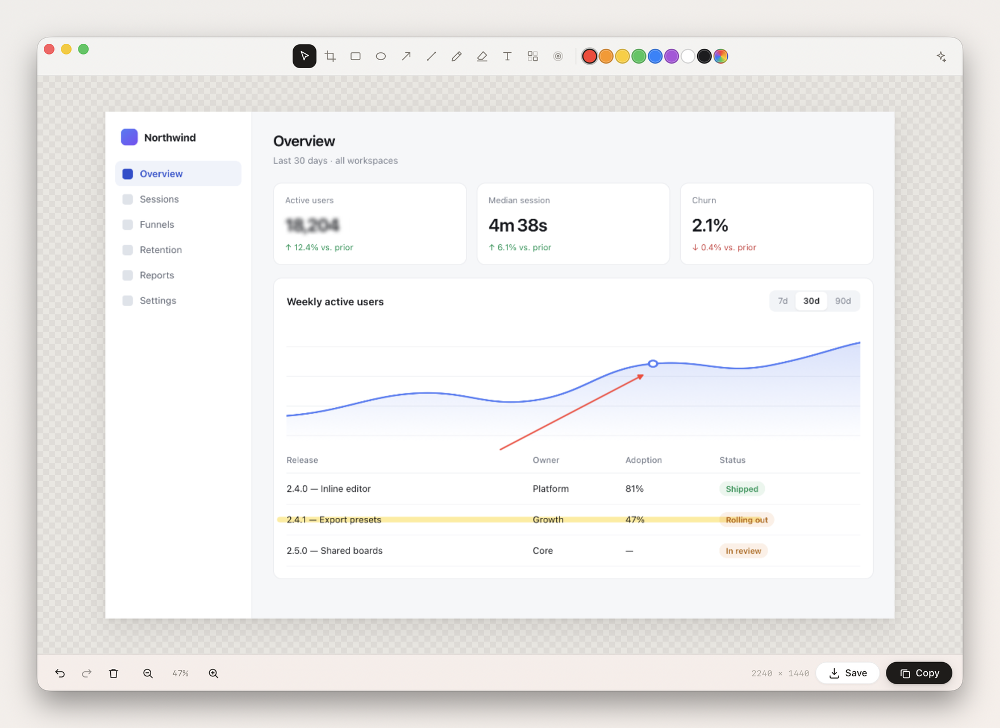
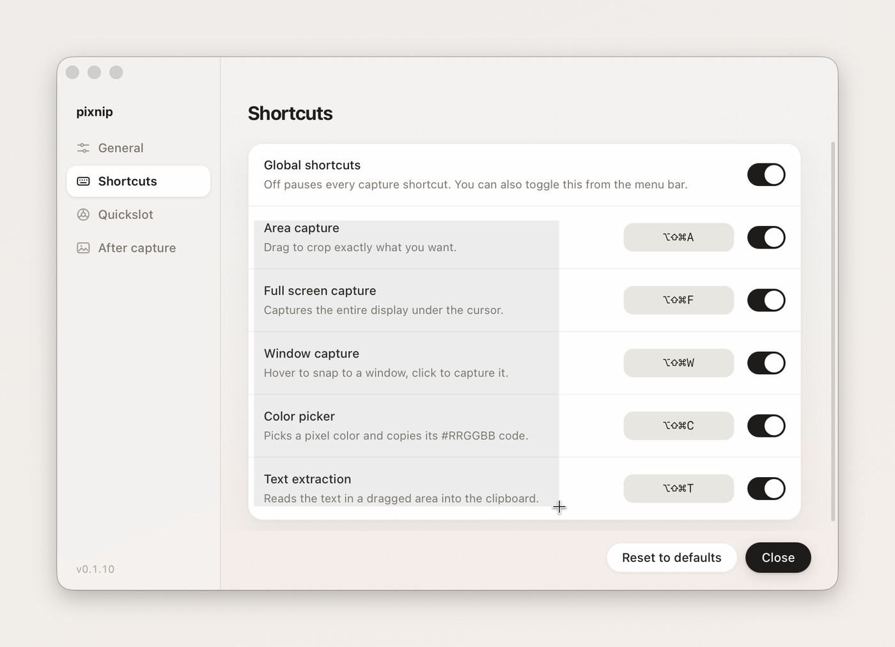
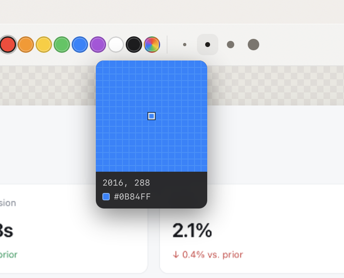
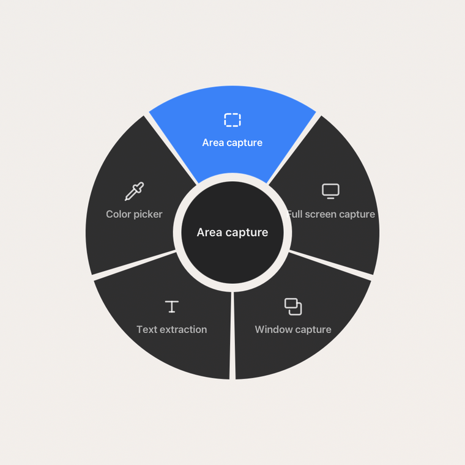
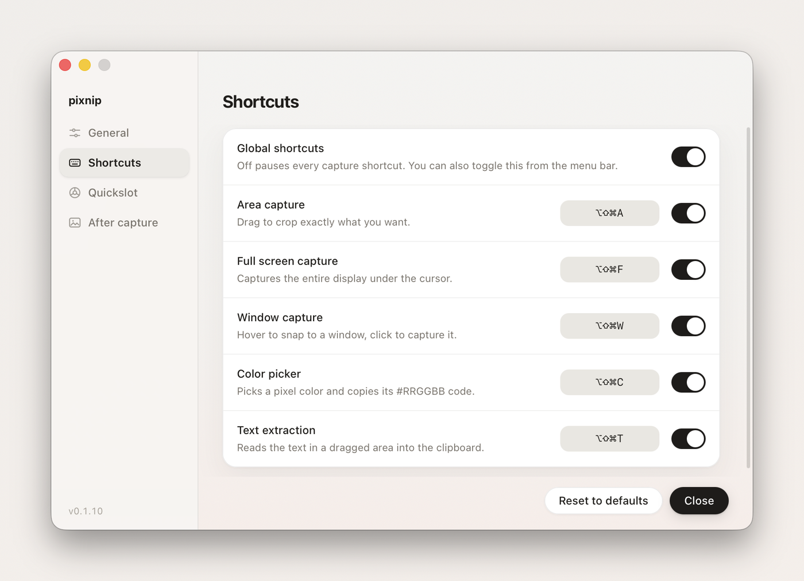
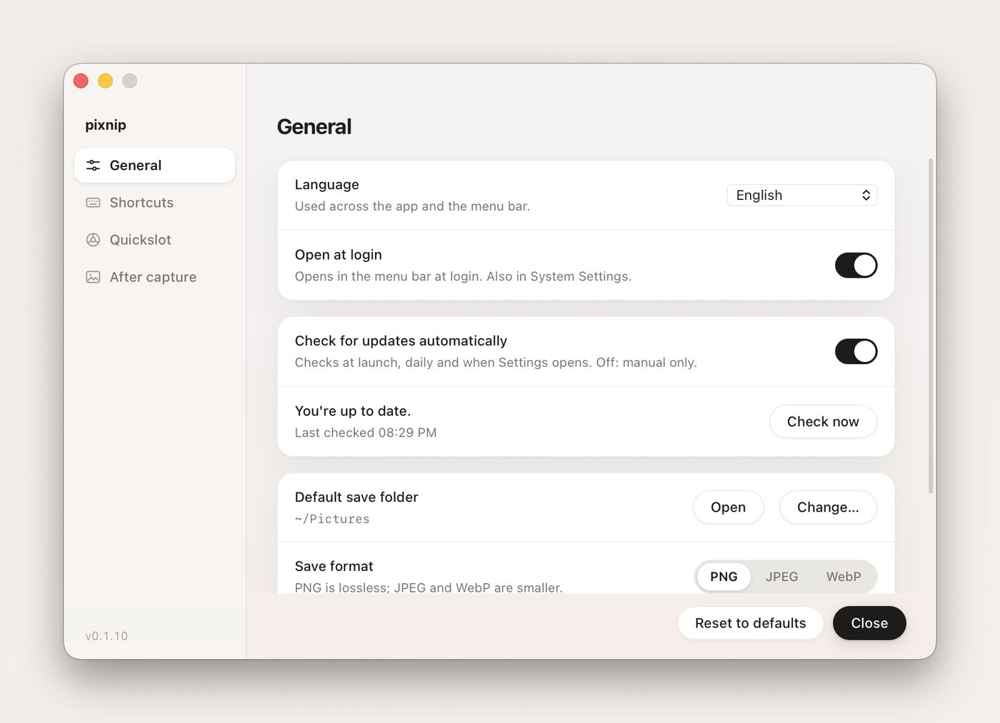

<div align="center">

# pixnip

**A screenshot tool for macOS.**

Press a shortcut, the screen freezes, drag — the image, or the text inside it,
is already on your clipboard.

macOS 14+ · Apple Silicon & Intel · light & dark · 10 languages

**English** · [한국어](README.ko.md)

</div>

## Install

```bash
brew tap 132262b/pixnip && brew trust --cask 132262b/pixnip/pixnip && brew install --cask pixnip
```

One line — paste it and you are done. The `brew trust` in the middle is the confirmation
Homebrew asks for on third-party taps.



## Catch the moment

Press the shortcut and you select right on the live screen. Turn on **Freeze screen** in
Settings → Capture and the picture holds still from the instant you pressed — a video
mid-frame, an open menu, a tooltip that disappears the moment you look away, all of it
stays exactly as you saw it.

|                     |                                                                                  |
| ------------------- | -------------------------------------------------------------------------------- |
| **Area**            | Drag exactly what you want. `Space` moves the selection, arrow keys nudge it 1 px |
| **Full screen**     | The whole display under the cursor                                               |
| **Window**          | Hover and the border snaps to the window; click to take it                       |
| **Pinned area**     | Pin a frame on screen and take the same spot on every press, app still usable    |
| **Screen recording** | Same frame, or a single window; system sound and mic optional — the editor opens  |
| **Color picker**    | Magnify down to the pixel and copy its `#RRGGBB`                                  |
| **Text extraction** | Read the text inside a dragged area straight into the clipboard                  |

## Text you can't select

Drag over any text on screen and it arrives on your clipboard as text — a screenshot a
colleague sent you, an error dialog that won't let you copy, a scanned PDF, a paused frame
of a video.



## Record it, then make it look good

Stop a recording and the dark video editor opens. Wherever you clicked, the picture zooms
in for a moment and follows your cursor; the cursor itself is redrawn smoothly with a
ripple on every click. Put the same wallpaper, gradient or solid background behind it as
a screenshot. The video is a clip on the timeline: split it at the playhead, delete
pieces, trim edges, and give each clip its own speed. Screen, system sound and mic sit
on separate layers with waveforms and per-track volume. Export as MP4 (H.264 or HEVC),
WebM or GIF at the original size, 1080p or 720p, 30 or 60 fps.

That drag put exactly this on the clipboard:

```
Area capture
Drag to crop exactly what you want.
Full screen capture
Captures the entire display under the cursor.
Window capture
Hover to snap to a window, click to capture it.
Color picker
Picks a pixel color and copies its #RRGGBB code.
Text extraction
Reads the text in a dragged area into the clipboard.
```

Line breaks are kept in reading order. It runs on the same recognizer macOS uses for Live
Text, so there is no model to download and nothing leaves your Mac. Korean and English are
recognized out of the box, and other languages are detected automatically.

## Pick a color from anywhere

Magnify down to the pixel and the `#RRGGBB` lands on your clipboard. The magnifier follows
the cursor across every display.



## One shortcut for all of them

Tap `⌘⇧⌥S` and the wheel opens where your cursor is. Aim, let go, it runs.



## From capture to markup, without a break

Every capture lands on the clipboard first, so you can paste it immediately. Click the
preview in the bottom-right corner and it opens straight into the editor.

Pen, highlighter, shapes, arrows, text, mosaic, blur and crop — each one key away.
`⌘S` saves to your folder, `⌘C` copies. The background button opens a side panel that
sets the shot on a wallpaper, gradient, solid color or your own image — with padding,
rounded corners, shadow and aspect ratios like 16:9 or 1:1, ready to share.

| Tool      | Key | Tool      | Key |
| --------- | --- | --------- | --- |
| Select    | V   | Text      | T   |
| Crop      | C   | Mosaic    | M   |
| Rectangle | R   | Blur      | B   |
| Ellipse   | O   | Highlight | H   |
| Arrow     | A   | Pen       | P   |

## Make it yours



Every shortcut is yours to change, and you can switch them off one by one or all at once
from the menu bar — handy when another app wants the same combination. The defaults stay
clear of the built-in macOS screenshot keys (`⌘⇧3/4/5`).



Save as PNG, JPEG or WebP with a quality slider, pick where files land, decide whether the
preview appears and how long it stays, freeze the screen while you select, open at login,
and update from inside the app. Right-click any image in Finder → **Open With → pixnip**
to edit it on the spot.

| Action           | Default |
| ---------------- | ------- |
| Area capture     | ⌘⇧⌥A    |
| Full screen      | ⌘⇧⌥F    |
| Window capture   | ⌘⇧⌥W    |
| Pinned area      | ⌘⇧⌥R    |
| Screen recording | ⌘⇧⌥V    |
| Color picker     | ⌘⇧⌥C    |
| Text extraction  | ⌘⇧⌥T    |
| Quickslot wheel  | ⌘⇧⌥S    |

## Update and uninstall

```bash
brew update && brew upgrade --cask pixnip     # or press Update in Settings
brew uninstall --cask pixnip
```

## About the install

pixnip is not notarized by Apple, so the cask removes the Gatekeeper quarantine attribute
after installing — without it macOS refuses to open the app at all. That also means it
cannot go into the official homebrew-cask. Everything the install does is right there in
[Casks/pixnip.rb](Casks/pixnip.rb), in plain sight.

This repository holds the cask and the release builds. The source lives in a private
repository.
